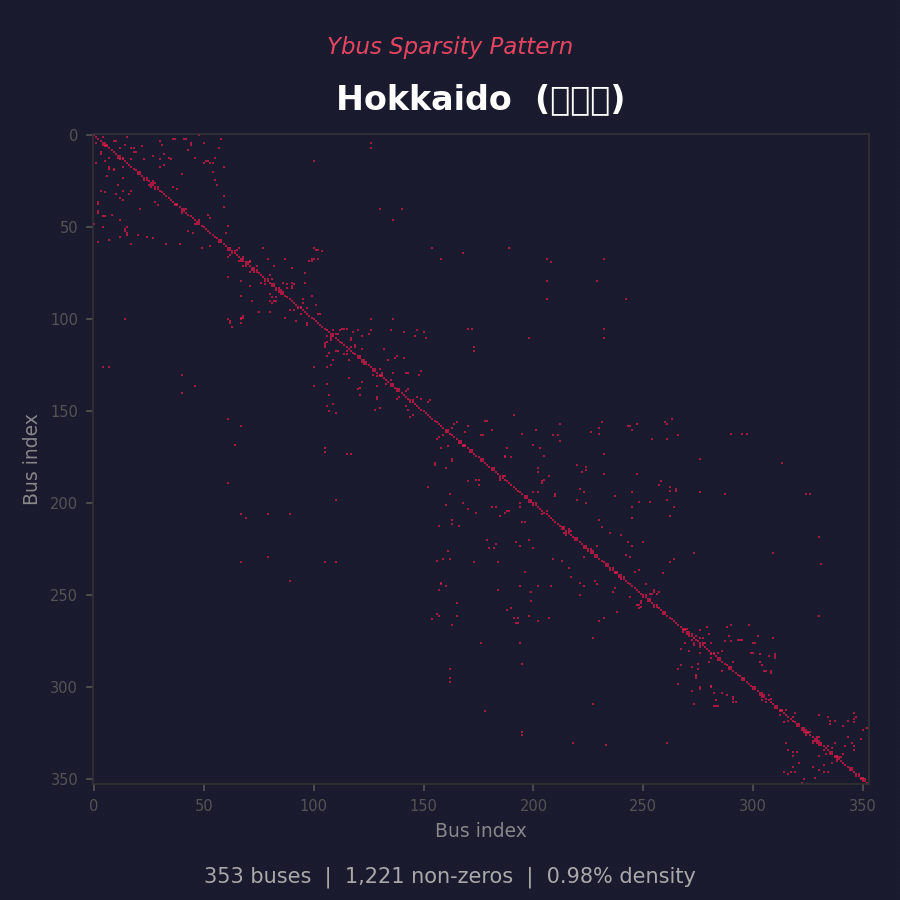

# All-Japan-Grid

Open Japanese power grid **geographic topology** dataset built from OpenStreetMap.
10 regions, 40,000+ transmission lines, 7,000+ substations, 19,000+ power plants.

**Live Map:** https://lutelute.github.io/All-Japan-Grid/

### Network Preview

| Network (Region Coloring) | Ybus Sparsity Pattern |
|:-------------------------:|:---------------------:|
|  |  |

> **Important:** This dataset provides the **geographic layout** of Japan's transmission infrastructure — where substations and lines are physically located and how they connect spatially. It is **not** a ready-to-use electrical model. See [Limitations](#limitations--what-this-data-is-not) below.

## Dataset

| Region | Substations | Lines | Plants | Frequency |
|--------|------------|-------|--------|-----------|
| Hokkaido | 303 | 1,879 | 436 | 50 Hz |
| Tohoku | 738 | 5,112 | 1,311 | 50 Hz |
| Tokyo | 1,367 | 8,052 | 7,207 | 50 Hz |
| Chubu | 898 | 5,284 | 3,792 | 60 Hz |
| Hokuriku | 273 | 1,604 | 432 | 60 Hz |
| Kansai | 1,016 | 5,960 | 1,518 | 60 Hz |
| Chugoku | 548 | 3,214 | 1,173 | 60 Hz |
| Shikoku | 258 | 1,532 | 688 | 60 Hz |
| Kyushu | 1,145 | 6,553 | 2,549 | 60 Hz |
| Okinawa | 416 | 887 | 32 | 60 Hz |

### File Format

GeoJSON FeatureCollection per region:
```
data/{region}_substations.geojson   # Point/Polygon features
data/{region}_lines.geojson         # LineString features
data/{region}_plants.geojson        # Point features (power plants)
```

Key properties (substations & lines):
- `voltage` — OSM voltage in volts (e.g. `"275000"`)
- `name` / `name:ja` — Facility name
- `operator` — Operating utility
- `cables`, `circuits` — Line specifications

Key properties (plants):
- `fuel_type` — Normalized: solar, hydro, coal, gas, nuclear, wind, etc.
- `capacity_mw` — Output capacity in MW (when available)
- `plant:source` — Raw OSM source tag
- `name` / `name:ja` — Plant name

### Data Source

All data is extracted from [OpenStreetMap](https://www.openstreetmap.org/) using the Overpass API:
- `power=substation` — Substations, switching stations
- `power=line` / `power=cable` — Transmission lines
- `power=plant` — Power plants (solar, hydro, thermal, nuclear, wind, etc.)

License: [ODbL](https://opendatacommons.org/licenses/odbl/) (OpenStreetMap)

## Interactive Map (GitHub Pages)

The static site at `docs/` renders all regions on a Leaflet.js dark map with voltage-based coloring.

Voltage filter presets: 500 kV, 275 kV+, 154 kV+, 110 kV+, 66 kV+, All

```bash
# Local preview
python -m http.server -d docs 8080
open http://localhost:8080
```

## Limitations — What This Data Is NOT

OSM provides the **geographic** skeleton of the transmission grid. To build a functioning electrical model (power flow, OPF, UC), the following are required but **missing** from this dataset:

| Missing | Why it matters | Potential source |
|---------|---------------|-----------------|
| **Line impedance (R, X, B)** | Required for any power flow calculation | Typical values by voltage class (synthetic), or OCCTO published parameters |
| **From/to bus connectivity** | OSM lines are geographic traces, not bus-bus connections; endpoint matching is heuristic and error-prone | Manual verification, OCCTO topology data |
| **Generator details** | OSM power=plant provides locations and fuel types, but lacks cost curves, min/max output, ramp rates | OCCTO supply plan, 国土数値情報 P03, JEPX data |
| **Load / demand** | No demand allocation at buses | OCCTO area demand, prefecture-level statistics, synthetic allocation |
| **Transformer data** | No tap ratios, impedance, winding configuration | Synthetic estimation or utility disclosure |
| **Switching topology** | Bus-section / breaker-level detail unavailable | Not publicly available in Japan |

### Lessons Learned

1. **"地図があるからデータがある" は誤り** — A map showing transmission lines does not imply that the underlying electrical parameters exist. Geographic data and electrical data are fundamentally different.
2. **容量データ ≠ 系統モデル** — Knowing a line is "275 kV" tells you the voltage class but nothing about impedance, thermal rating, or actual connectivity.
3. **Endpoint matching is fragile** — Heuristic from/to bus estimation from geographic proximity produces many mismatches. A 50 km threshold catches most connections but also creates false links.
4. **Japanese name normalization** — `変電所`, `発電所`, `開閉所` have multiple orthographies (kanji/kana/abbreviation). Fuzzy matching is essential.
5. **Null diversity** — OSM features may have `voltage=null`, `voltage=""`, `voltage="yes"`, or no voltage tag at all. Robust parsing must handle all cases.
6. **Regional scope & name resolution** — The same substation name can appear in multiple regions. Name-based matching must be scoped to the correct region.
7. **AC power flow on OSM topology produces physically meaningless results** — Without proper impedance data, generator dispatch, and demand allocation, power flow output is numerical noise, not engineering insight.

## What This Data IS Good For

- **Visualization**: Interactive maps of Japan's transmission infrastructure by voltage class and region
- **Topology research**: Graph-theoretic analysis of network connectivity, redundancy, vulnerability
- **Geographic reference**: Substation locations and transmission corridors for spatial analysis
- **Starting point for synthetic models**: Geographic skeleton to be enriched with electrical parameters from other sources
- **Education**: Understanding the structure of Japan's 10 regional grids and the 50/60 Hz boundary

## Analysis Tools (Experimental)

The `src/` directory contains power flow and UC solver code. These tools work correctly on **complete** electrical models (e.g. MATPOWER test cases) but produce unreliable results on raw OSM topology due to the missing data described above.

They are included as reference implementations for future use when combined with complementary data sources.

### Local Server

```bash
pip install -r requirements.txt
uvicorn src.server.app:app --reload
open http://localhost:8000
```

### Included Tools

| Module | Purpose | Status |
|--------|---------|--------|
| `src/server/` | FastAPI web server, interactive map | Works (visualization) |
| `src/powerflow/` | DC/AC power flow via pandapower | Requires electrical parameters |
| `src/ac_powerflow/` | Advanced AC methods | Requires electrical parameters |
| `src/uc/` | Unit Commitment (MILP, PuLP + HiGHS) | Requires generators + demand |
| `src/converter/` | pandapower / MATPOWER export | Works (structural export) |

## Future Work — Complementary Data Sources

To build a usable electrical model, this geographic topology needs to be combined with:

| Data source | What it provides | Access |
|-------------|-----------------|--------|
| **OCCTO** (電力広域的運営推進機関) | Interconnection capacity, area demand, supply-demand plans | [occto.or.jp](https://www.occto.or.jp/) (public reports) |
| **国土数値情報 P03** | Power plant locations, capacity, fuel type | [nlftp.mlit.go.jp](https://nlftp.mlit.go.jp/ksj/) (open data) |
| **JEPX** (日本卸電力取引所) | Spot market prices, area price signals | [jepx.jp](http://www.jepx.jp/) (public) |
| **PyPSA-Earth / atlite** | Renewable resource data, synthetic grid enrichment | [pypsa-earth.readthedocs.io](https://pypsa-earth.readthedocs.io/) |
| **MATPOWER test cases** | Validated IEEE/PGLIB models for benchmarking | [matpower.org](https://matpower.org/) |
| **Synthetic line parameters** | R/X/B estimation by voltage class and conductor type | Literature values (e.g. Glover, Sarma & Overbye) |

Contributions and collaborations welcome. If you have access to additional data sources or are working on Japanese grid modeling, please open an issue.

## Project Structure

```
data/                  GeoJSON network data (10 regions)
config/regions.yaml    Region metadata (frequency, voltage levels, bounding boxes)
src/
  model/               Data models (Substation, TransmissionLine, Generator)
  converter/           pandapower / MATPOWER conversion
  powerflow/           DC/AC power flow runner (experimental)
  ac_powerflow/        Advanced AC power flow (experimental)
  uc/                  Unit Commitment solver (experimental)
  server/              FastAPI web server + GeoJSON loader
  utils/               Geographic utilities
examples/              Demo scripts (power flow, UC, visualization)
docs/                  GitHub Pages static site
scripts/               Build tools (static site generator, OSM fetch)
schemas/               XML schema definitions
tests/                 pytest test suite
```

## Requirements

Python 3.10+

```bash
pip install -r requirements.txt
```

Key dependencies: pandapower, fastapi, pulp, highspy, pyyaml, geopandas

## License

- Network data: [ODbL](https://opendatacommons.org/licenses/odbl/) (OpenStreetMap)
- Code: MIT
